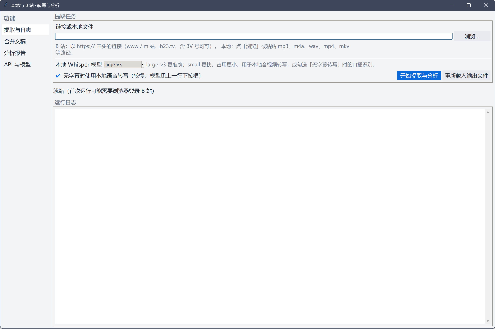
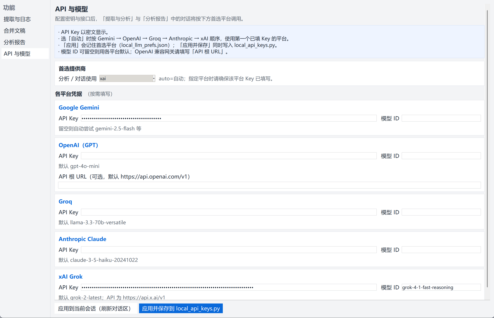
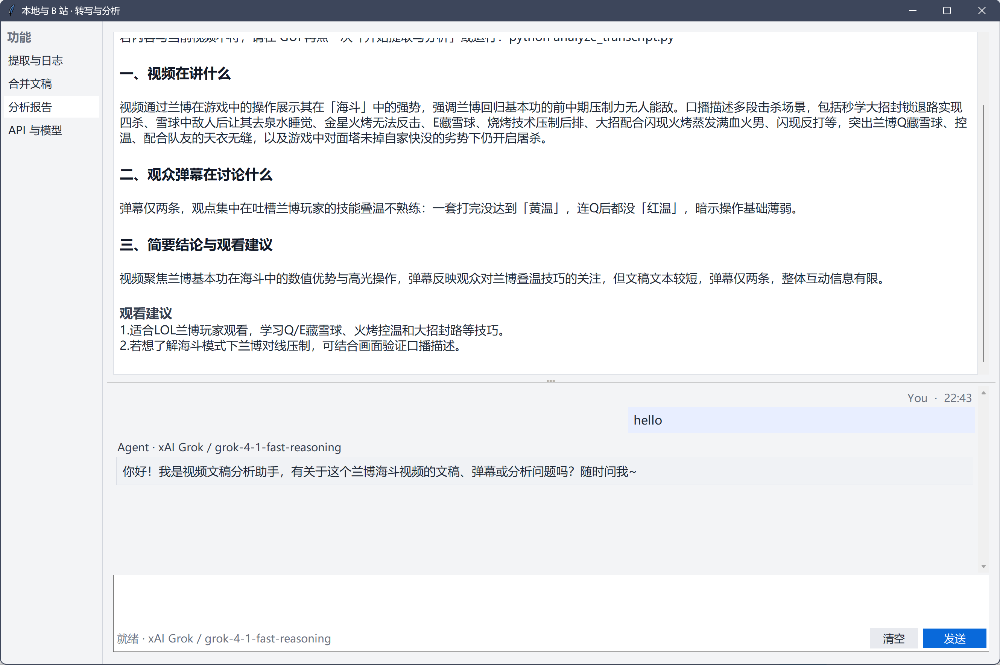

<div align="center">

# Bilibili Transcript One-Click

**本地音视频与哔哩哔哩链接** → 字幕 / 弹幕 / 可选 **faster-whisper** 转写 → 合并文稿 → 可选 **多模型 LLM** 分析与对话  

*Windows 便携向：嵌入式 Python + Playwright 登录，双击 `START.bat` 即用*

[](https://github.com/Jcxu97/bilibili-transcript-oneclick/actions/workflows/ci.yml)
[](LICENSE)
[](https://www.python.org/)

[**界面预览**](#screenshots) · [**快速开始**](#quickstart) · [**API 配置**](#api-keys) · [**相关项目**](#related)

</div>

---

## 亮点

| | |
|:---|:---|
| **一体化** | B 站拉流、登录态、字幕与弹幕合并、无字幕时 ASR、分析报告与**底部多轮对话**在同套 GUI 内完成 |
| **多模型** | 支持 **Gemini / OpenAI / Groq / Anthropic / xAI** 等，纯 `urllib` 实现分析，无额外 LLM SDK 依赖 |
| **便携** | 脚本引导下载 embed Python、Chromium、Whisper 模型；大文件不入 Git，见下表 |
| **本地优先** | **faster-whisper** + **ctranslate2**；可选 `requirements-gpu.txt` 安装 CUDA 12 运行库以稳定用 GPU |

---

## 目录

- [功能概览](#features)
- [界面预览](#screenshots)
- [环境要求](#requirements)
- [快速开始](#quickstart)
- [本仓库不包含](#not-in-repo)
- [API / 大模型（可选）](#api-keys)
- [命令行](#cli)
- [GPU（Windows）](#gpu)
- [推送到 GitHub（维护者）](#github-push)
- [相关项目](#related)
- [安全](#security)
- [许可证](#license)
- [English](#english)

---

<a id="features"></a>

## 功能概览

- **图形界面**：`START.bat` / `启动.bat` → `gui.py`
- **命令行**：`bilibili_pipeline.py extract <URL | 本地媒体路径>`
- **B 站登录**：Playwright Chromium，会话 `browser_state.json`，并导出 `cookies.txt` 供 yt-dlp
- **无字幕转写**：yt-dlp 拉音频 + faster-whisper；GUI 可选 **large-v3** / **small**
- **FFmpeg**：优先使用目录 `ffmpeg/` 下可执行文件，其次系统 `PATH`，再次依赖包内 static-ffmpeg（可能访问外网）

---

<a id="screenshots"></a>

## 界面预览

便携环境就绪后启动 GUI 的主要页面：

<table>
<tr>
<td width="33%" align="center"><b>提取与日志</b><br/>链接 / 本地文件、Whisper、运行日志</td>
<td width="33%" align="center"><b>API 与模型</b><br/>多平台 Key、首选提供商</td>
<td width="33%" align="center"><b>分析报告 + 对话</b><br/>结构化报告与多轮问答</td>
</tr>
<tr>
<td valign="top"></td>
<td valign="top"></td>
<td valign="top"></td>
</tr>
</table>

<details>
<summary>若表格内图片未显示，可点此查看与正文相同的 Markdown 图片链接</summary>


</details>

---

<a id="requirements"></a>

## 环境要求

- **Windows 10 / 11 x64**（当前脚本与说明以此为主）
- 首次准备环境时需能访问 **python.org、pip、Playwright CDN、Hugging Face**（按需）

---

<a id="quickstart"></a>

## 快速开始

1. 克隆本仓库。
2. 在仓库根目录打开 **PowerShell**，执行（需联网）：

```powershell
Set-ExecutionPolicy -Scope CurrentUser RemoteSigned -Force
.\准备便携环境.ps1
```

3. 若需 **GPU 转写**，可额外执行：  
   `.\python_embed\python.exe -m pip install -r requirements-gpu.txt`
4. 双击 **`START.bat`** 或 **`启动.bat`** 打开 GUI。首次使用 B 站功能时按提示在 Chromium 中登录。

**跳过 Whisper 预下载**（加快首次脚本时间）：

```powershell
.\准备便携环境.ps1 -SkipWhisperModel
```

**仅下载 Whisper 模型**（默认 large-v3 + small）：

```powershell
.\DOWNLOAD_WHISPER.bat
# 或
.\python_embed\python.exe .\download_whisper_models.py
```

**补充 tkinter**（embed 默认无 GUI 库）：`.\INSTALL_TKINTER.bat` 或 `.\add_tkinter_to_embed.ps1`。

**Chromium 下载失败**：多试 `install_chromium.bat`，或按 [Playwright 文档](https://playwright.dev/docs/browsers) 将浏览器放入 `pw-browsers`。

---

<a id="not-in-repo"></a>

## 本仓库不包含

以下路径因体积或环境差异 **不在 Git 中**（见 `.gitignore`），由 `准备便携环境.ps1` 或你本机自行准备：

| 路径 | 说明 |
|------|------|
| `python_embed/` | 官方 Embeddable Python + pip 依赖 |
| `pw-browsers/` | Playwright Chromium |
| `whisper-models/` | 可选；缺失时首次 ASR 从 Hugging Face 拉取 |
| `ffmpeg/*.exe` | 可选；放入 `ffmpeg.exe` / `ffprobe.exe` 可减少对外网依赖 |

---

<a id="api-keys"></a>

## API / 大模型（可选）

在 GUI **「API 与模型」** 中填写 **Gemini / OpenAI / Groq / Anthropic / xAI** 的 Key 与模型 ID，选择「首选提供商」或「自动」。

也可复制 `local_api_keys.example.py` 为 `local_api_keys.py`（**勿提交**），或设置环境变量。逻辑见 `llm_analyze.py`。

---

<a id="cli"></a>

## 命令行

```text
python_embed\python.exe bilibili_pipeline.py extract "https://www.bilibili.com/video/BVxxxx"
python_embed\python.exe bilibili_pipeline.py extract --asr-if-no-subs --whisper-model small "https://..."
```

---

<a id="gpu"></a>

## GPU（Windows）

无字幕转写使用 **faster-whisper / ctranslate2**。若缺 `cublas64_12.dll` 等，可安装与 wheel 匹配的 **CUDA 12** 运行库，或在 embed 环境中执行：

```powershell
.\python_embed\python.exe -m pip install -r requirements-gpu.txt
```

详见仓库内 `requirements-gpu.txt`。仍需可用的 **NVIDIA 驱动**。

---

<a id="github-push"></a>

## 推送到 GitHub（维护者）

本仓库含 **GitHub Actions**（`.github/workflows/ci.yml`）与 **`SECURITY.md`**。

**推荐**：安装 Git 与 [GitHub CLI](https://cli.github.com/) 后执行：

```powershell
powershell -ExecutionPolicy Bypass -File ".\一键推送GitHub.ps1"
```

**手动**：网页新建空仓库后 `git remote add origin …` 与 `git push -u origin main`。勿提交 `local_api_keys.py`、`cookies.txt` 等（已在 `.gitignore`）。

---

<a id="related"></a>

## 相关项目

下列开源项目与「B 站 / 字幕 / Whisper」相关，**侧重不同**，可与本仓库对照选用：

| 项目 | 侧重点 | 说明 |
|------|--------|------|
| [lanbinleo/bili2text](https://github.com/lanbinleo/bili2text) | B 站 → 文字 | 下载、分段、多引擎转写（Whisper / SenseVoice / 云 API），有 CLI / Web / 桌面 |
| [LuShan123888/Bilibili-Captions](https://github.com/LuShan123888/Bilibili-Captions)（`video-captions`） | 多平台字幕 | B 站 / YouTube / 本地；API 字幕优先，无字幕后 ASR；含 MCP |
| [pluja/whishper](https://github.com/pluja/whishper) | 本地转写 Web UI | faster-whisper + 字幕编辑；URL 依赖 yt-dlp，非 B 站专用 |
| [ShadyLeaf/Bili2Text](https://github.com/ShadyLeaf/Bili2Text) | 轻量示例 | Whisper 转 B 站视频，小体量脚本向 |
| [Frewen/BiliSpeech2Text](https://github.com/Frewen/BiliSpeech2Text) | 流水线脚本 | 下载、切分、Whisper，支持合集等 |

**本仓库差异（简要）**：在常见「B 站转文字」之外，强调 **弹幕与字幕合并**、**Playwright 登录与 cookie**、**Windows embed 便携组装**，以及 **合并文稿上的 LLM 分析报告 + 同页多轮对话**。

---

<a id="security"></a>

## 安全

勿公开分享含密钥的文件（如 `local_api_keys.py`、`local_llm_prefs.json`、`cookies.txt`、`browser_state.json`）。说明见 [`SECURITY.md`](SECURITY.md)。

---

<a id="license"></a>

## 许可证

[MIT License](LICENSE)

---

<a id="english"></a>

## English

**Bilibili Transcript One-Click** is a Windows-oriented toolkit: fetch Bilibili subtitles and danmaku (with optional Playwright login), merge transcripts, optionally run **faster-whisper** when no subtitles exist, then optionally call **Gemini / OpenAI / Groq / Anthropic / xAI** for a structured report and follow-up chat in the GUI.

Large binaries (`python_embed`, `pw-browsers`, Whisper weights, optional `ffmpeg` exes) are **not** in Git; run `准备便携环境.ps1` to bootstrap. Use `START.bat` to launch the UI.

**Related projects**: see the [table above](#related) — tools like [bili2text](https://github.com/lanbinleo/bili2text) focus on transcription pipelines; this repo adds merged danmaku/subtitle workflow, portable embed layout, and integrated LLM report + chat.
